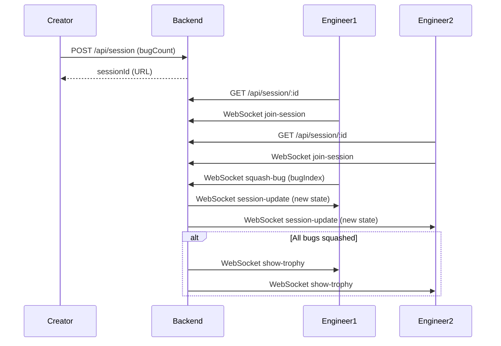

# Bug Bash Webapp – Detailed Plan

## 1. Project Structure

```
bugbash/
  ├── backend/
  │     ├── package.json
  │     ├── server.js
  │     └── ... (session/state logic)
  ├── frontend/
  │     ├── package.json
  │     ├── public/
  │     │     ├── bug.png
  │     │     └── trophy.png
  │     └── src/
  │           ├── App.jsx
  │           ├── CreateSession.jsx
  │           ├── Game.jsx
  │           ├── Bug.jsx
  │           └── ...
  └── README.md
```

---

## 2. Component & API Design

### a. Frontend (React)
- **CreateSession.jsx**: Form to input number of bugs, calls backend to create session, displays shareable URL.
- **Game.jsx**: Loads session by ID, displays bugs, handles click-to-squash, listens for real-time updates.
- **Bug.jsx**: Renders a bug image, handles squash animation.
- **App.jsx**: Routing between create and game pages.

### b. Backend (Node.js/Express + Socket.IO)
- **POST /api/session**: Create a new session, returns unique session ID.
- **GET /api/session/:id**: Get session state (number of bugs, squashed bugs).
- **WebSocket events**:
    - `join-session`: Client joins a session room.
    - `squash-bug`: Client squashes a bug; server updates state and broadcasts to all clients.
    - `session-update`: Server broadcasts updated bug state to all clients in session.

### c. Game State
- In-memory JS object:
    ```js
    {
      [sessionId]: {
        bugCount: 10,
        squashed: [2, 5, 7], // indices of squashed bugs
        createdAt: Date
      }
    }
    ```
- When all bugs are squashed, server notifies clients to show trophy.

---

## 3. Real-Time Flow (Mermaid Diagram)



---

## 4. Assets

- Use open-source cartoon bug and trophy images (can be swapped later).

---

## 5. Development Steps

1. Scaffold backend (Express + Socket.IO, session state logic, REST + WebSocket API).
2. Scaffold frontend (React, CreateSession, Game, Bug components, connect to backend).
3. Add real-time updates (Socket.IO client).
4. Add assets and basic styling/animations.
5. Test locally.

---

## 6. Summary

- **Frontend:** React (local/demo use)
- **Backend:** Node.js/Express + Socket.IO (in-memory state)
- **No authentication, no persistent storage required**
- **Fun, real-time bug squashing experience for engineers**